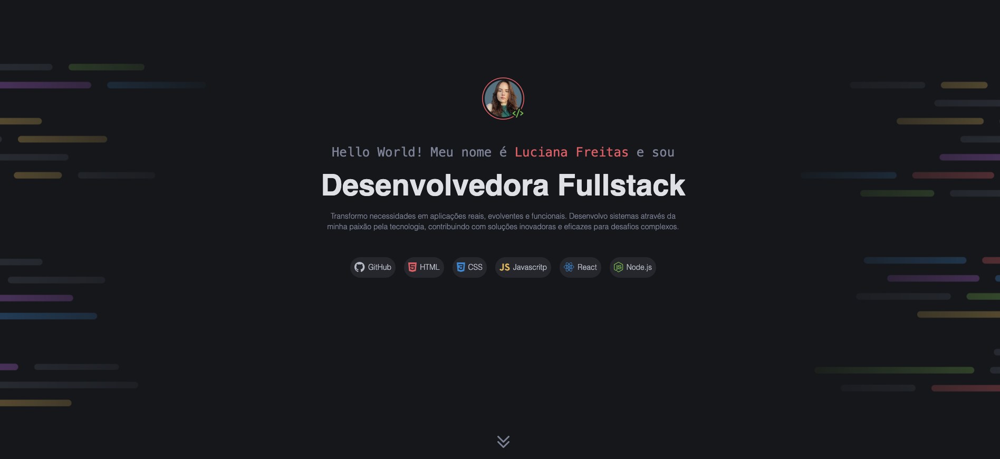

# Portfólio • Luciana Freitas



Este repositório contém o código do meu **portfólio pessoal**, desenvolvido para apresentar meus projetos, habilidades e serviços como desenvolvedora Fullstack.

O foco do projeto é uma interface moderna, organizada e responsiva, utilizando apenas **HTML e CSS**, com boas práticas de estrutura e semântica.

---

## ✨ Visão Geral

O portfólio é dividido em seções bem definidas:

- Apresentação pessoal (Hero)
- Projetos em destaque
- Serviços oferecidos
- Contato e redes sociais

O layout foi pensado para ser intuitivo, visualmente limpo e profissional.

---

## 🛠️ Tecnologias Utilizadas

- **HTML5** — Estrutura semântica
- **CSS3** — Layout, responsividade e estilização
- **Google Fonts**
- Organização modular de estilos

---

## 🚀 Como visualizar o projeto

1. Clone o repositório:
```bash
git clone https://github.com/seu-usuario/portfolio-dev.git